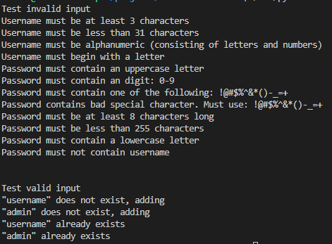

# [Password](https://github.com/joebobfisher/software-craftsmanship-club/tree/main/password)
Written for chapter 7 of Clean Code: Error Handling.

## Problem

Create a program/class/whatever that will store Username/password combinations, as well as tell us whether a Username
exists.

If a "bad" Username and/or password is given, however, then the code will throw an error.

### Getting and Setting Passwords

The usernames and passwords will be given by the user as strings -- it's up to you if you want your code to read them in
as separate strings or as an object, data structure, tuple, or something else, but the raw values themselves will be
strings.

The "get user" functionality should take a Username string and return true if the user exists (and thus has a password
set). If the Username is not found, then it should return false.

The "set password" functionality shouldn't return any value, but should store the Username & password in memory. The
Username and password strings both have constraints on what they can contain; if the user tries to store a
Username/password combination that breaks these constraints, then an error should be thrown (more on that later).

If a Username is given to "set password" that has been given before, then the new password should overwrite the old one.

### Constraints
There are constraints on what the Username and password can contain.

#### Username Constraints
* Must be at least 3 characters long and no longer than 31 characters
* Must be alphanumeric only
* Must start with an alphabetic character

#### PasswordObject Constraints
* Must be between 8 and 255 characters long
* Must contain at least one:
  * lowercase alphabetic character
  * uppercase alphabetic character
  * digit
  * special character from the group:
    ```
    !@#$%^&*()-_=+
    ```
* Must not contain the Username, _regardless of case_

### Errors

#### Username Errors
Write an error for each of the above Username constraints. For example (you definitely don't need to use these exact
names):

* `UsernameTooShort`
* `UsernameTooLong`
* `UsernameBadCharacters`
* `UsernameStartsWithANumber`

#### PasswordObject Errors
Write an error for each of the above password constraints, e.g.:

* `PasswordTooShort`
* `PasswordTooLong`
* `PasswordBadCharacters`
* `PasswordNoLowerAlpha`
* `PasswordNoUpperAlpha`
* `PasswordNoDigit`
* `PasswordNoSpecialChar`
* `PasswordContainsUsername`

### Bonus Points If
These extra criteria are not at all required, and are only given as an extra challenge if the above kata was too easy,
or if you're one of those people who need to finish absolutely everything. 🤪

* You read/write the Username+password values from a file.
* You hash the password values in storage so they're not stored in plaintext.
* You create an interface where the Username and password can be given on the command line, with the password blanked 
  out or shown as `*`s when being typed in.

## Result
